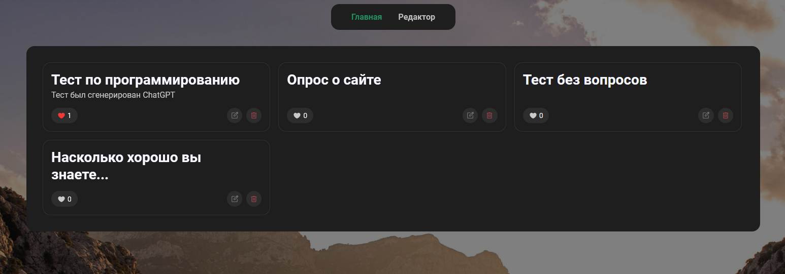

## Test Forms

## Setup

1. Install PHP 8.0+
2. Set MySQL creds to /api/config.php file
3. Run server

## API

**prefix: /api**

**API doesn't have authorization!**

### Tests

- GET /tests/index.php

  Get list of all tests (sorting by likes)

- GET /tests/index.php?id=$ID

  Get info about test with given ID (sorting by likes)

- POST /tests/index.php

  Create a new test

- PUT /tests/index.php?id=$ID

  Edit all test fields

- DELETE /tests/index.php?id=$ID

  Delete a test with given ID

#### Like

- GET /tests/like.php?id=$ID

  Get test likes with given ID

- POST /tests/like.php?id=$ID

  Add a like to test with given ID

- DELETE /tests/like.php?id=$ID

  Delete a like from test with given ID

#### Question

- GET /tests/questions/index.php

  Get list of all questions (without answers)

- GET /tests/questions/index.php?id=$ID

  Get question with given ID

- GET /tests/questions/index.php?test_id=$ID

  Get questions by test ID

- POST /tests/questions/index.php?test_id=$ID

  Create a new question for test with given ID

- PUT /tests/questions/index.php?id=$ID

  Edit all question fields (without answers)

- DELETE /tests/questions/index.php?id=$ID

  Delete a question with given ID

#### Answers

- GET /tests/questions/answers.php

  Get list of all answers

- GET /tests/questions/answers.php?id=$ID

  Get answer with given ID

- GET /tests/questions/answers.php?question_id=$ID

  Get answers by question ID

- POST /tests/questions/answers.php?question_id=$ID

  Create a new answer for question with given ID

- PUT /tests/questions/answers.php?id=$ID

  Edit all answer fields

- DELETE /tests/questions/answers.php?id=$ID

  Delete a answer with given ID

#### Full

- POST /tests/full.php

  Create a test with questions and answers

- PUT /tests/full.php?id=$ID

  Update a full data of test with questions and answers
